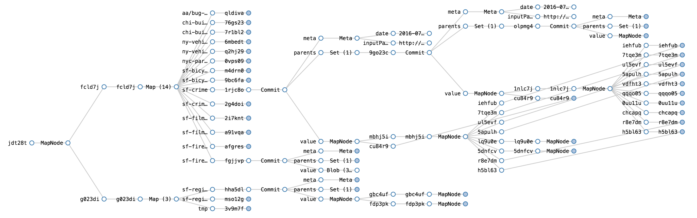
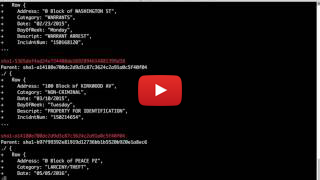
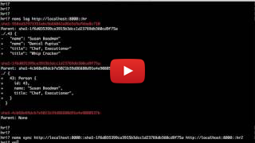

<br>
[Command-Line Tour](doc/cli-tour.md)&nbsp; | &nbsp;[Go SDK Tour](doc/go-tour.md)&nbsp; | &nbsp;[Documentation](doc/index.md)&nbsp; | &nbsp;[Project Status](#status)&nbsp; | &nbsp;[Download](https://s3-us-west-2.amazonaws.com/downloadstable.noms.io/index.html?prefix=jobs/NomsBuildGoBinaries-v7/)
<br><br>
[](http://jenkins3.noms.io/job/NomsMasterBuilder/)
[](https://codecov.io/gh/attic-labs/noms)
[](https://godoc.org/github.com/attic-labs/noms)
[](http://slack.noms.io)

*Noms* is a decentralized database philosophically descendant from the Git version control system.

Like Git, Noms is:

* *Versioned:* By default, all previous versions of the database are retained. You can trivially audit how the database evolved to its current version, easily and efficiently compare any two versions, or even rewind and branch from any previous version.
* *Synchronizable:* Noms databases can evolve disconnected from each other for any amount of time, then later reconcile their changes efficiently and correctly.

Unlike Git, Noms is a database, so it:

* Primarily stores structured data, not files and directories (see: the Noms type system)
* Scales well to large amounts of data and concurrent clients (see: benchmarks)
* Supports atomic transactions (when run in AWS, Noms is "effectively CA")
* Supports efficient indexes (see: Noms prolly-trees)
* Featuers a flexible query model (see: GraphQL)

Finally, because Noms is content-addressed, it yields what we find to be a very pleasant programming model. Working with Noms is _declarative_. You don't INSERT new data, UPDATE existing data, or REMOVE old data. You simply _declare_ what the data ought to be right now. Noms transparently figures out how to translate that into writes and deletes.

<br>

## Install Noms

Noms is supported on Mac OS X and Linux. While Windows isn't officially supported, you can compile a Windows build from source, and it usually works.

1. [Download the latest build](https://s3-us-west-2.amazonaws.com/downloadstable.noms.io/index.html?prefix=jobs/NomsBuildGoBinaries-v7/)

  The build contains the Noms command-line and some utility tools. You can use `tar -ztvf noms-*.tar.gz` to view the contents of the tar.

2. Extract the Noms commands.

  `tar -xzf noms-*.tar.gz`

3. Use the `noms ds` command to connect to the `cli-tour` database.

    ```
    ./noms ds http://demo.noms.io/cli-tour
    chi-building-violations
    chi-building-violations/backup
    chi-building-violations/raw
    ...<snip>..
    sf-film-locations
    sf-film-locations/raw
    sf-fire-inspections
    sf-fire-inspections/raw
    sf-registered-business
    sf-registered-business/raw
    ```

4. View the history for the `sf-film-locations` dataset.

    ```
    ./noms log http://demo.noms.io/cli-tour::sf-film-locations
    ```

Next, you can explore a Noms database or [take a tour of the CLI commands](doc/cli-tour.md).

<br/>
## Explore a demo instance of Noms

<a href="http://splore.noms.io/?db=https://demo.noms.io/cli-tour"><br>Visually explore a demo instance of Noms.</a>

<br>
## What Noms is Good For

#### Data Version Control

Noms gives you the entire Git workflow, but for large-scale structured (or unstructured) data. Fork, merge, track history, efficiently synchronize changes, etc.

[](https://www.youtube.com/watch?v=Zeg9CY3BMes)<br/>
*[`noms diff` and `noms log` on large datasets](https://www.youtube.com/watch?v=Zeg9CY3BMes)*


#### An Application Database with History

A database where every change is automatically and efficiently preserved. Instantly revert to, fork, or work from any historical commit.

[](https://www.youtube.com/watch?v=JDO3z0vHEso)<br/>
*[Versioning, Diffing, and Syncing with Noms](https://www.youtube.com/watch?v=JDO3z0vHEso)*


#### An Archival Database

Trivially import snapshots from any format or API. Data is automatically versioned and deduplicated. Track the history of each datasource. Search across data sources.

*TODO: Sample and video*


<br>
## Status

#### Data Format

We are fairly confident in the core data format, and plan to support Noms database [version `7`](https://github.com/attic-labs/noms/blob/master/go/constants/version.go#L8) and forward. If you create a database with Noms today, future versions will have migration tools to pull your databases forward.


#### Completeness

We're just getting started. Some important features are not yet implemented including a query system, concurrency, auto-merging, and GC.

#### API

The Public API will continue to evolve. Pull requests which represent breaking API changes should be marked with `APIChange` and sent to the slack channel and mailing list below for advance warning and feedback.

<br>
## Talk

- [Slack](http://slack.noms.io)
- [Mailing List](https://groups.google.com/forum/#!forum/nomsdb)
- [Twitter](https://twitter.com/nomsdb)
