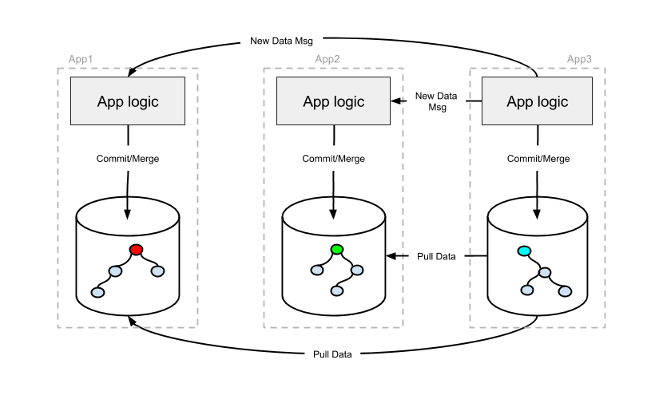
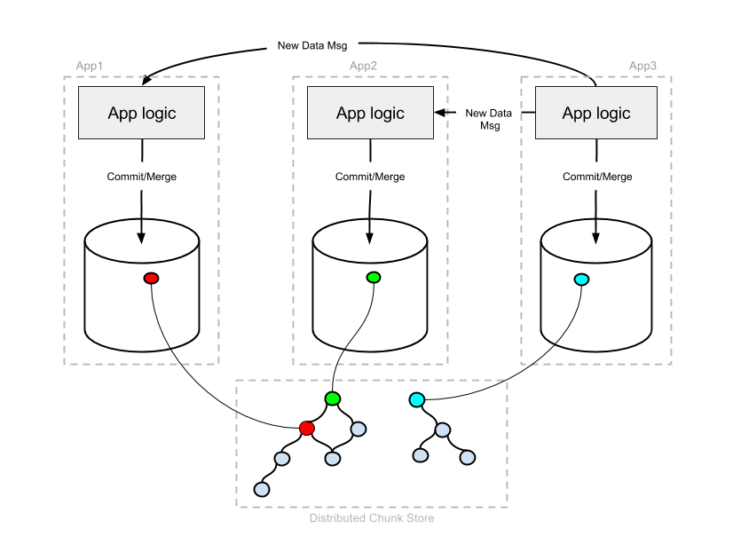

[Home](../../README.md) » [Use Cases](../../README.md#use-cases) » **Decentralized** »

[About](about.md)&nbsp; | &nbsp;[Quickstart](quickstart.md)&nbsp; | **Architectures**&nbsp; | &nbsp;[P2P Chat Demo](demo-p2p-chat.md)&nbsp; | &nbsp;[IPFS Chat Demo](demo-ipfs-chat.md)
<br><br>

# Architectures

There are many possible ways to use Noms as part of a decentralized application. Noms can naturally be mixed and matched with other decentralized tools like blockchains, IPFS, etc. This page lists a few approaches we find promising.

## Classic P2P Architecture

Noms can be used to implement apps in a peer-to-peer configuration. Each instance of the application (i.e., each "node") maintains a database locally with the data that is relevant to it. When a node creates new data, it commits that data to it's database and broadcasts a message to it's peers that contains the hash of it's lastest commit.
  

 
Peers that are listening for these message can decide if that data is relevant to them. Those that are interested can pull the new data from the publisher. The two clients efficiently communicate so that only data that isn't present in the requesting client is transmitted (much the same way that one git client sends source changes to another).

Peers can use a flow similar to the following in order to sync changes with one another:

```nohighlight
for {
   listen for new message
   if new msg is relevant {
      if new msg is ancestor of current commit {
         // nothing to do
         continue
      }
      pull new data from sender of msg
      if current head is ancestor of new msg {
         // fast forward to the new commit
         set head of dataset to new commit
         continue
      }
      merge new with current head and commit
      publish new commit
   }
}
```

Noms has a default [merge policy](https://github.com/attic-labs/noms/blob/2d0e9e738370d49cc09e8fa6e290ceca1c3e2005/go/merge/three_way.go#L14) that covers many classes of concurrent operations. If the application restricts itself to only operations that are mergeable by this policy, then Noms can automatically merge all concurrent changes. In this case, the entire database is effectively a CRDT.

If this is not sufficient, then applications can create their own merge policies, implementing whatever merge is appropriate for their use case.

# Decentralized Chunkstore Architecture

Another potential architecture for decentralized apps uses a decentralized chunkstore (such as IPFS, Swarm, or Sia) rather than local databases. In this case, rather than each node maintaining a local datastore, Noms chunks are stored in a decentralized chunkstore. The underlying chunkstore is responsible for making chunks available when needed. 



The flow used by peers to sync with one another is similar to the peer-to-peer architecture. The main difference is data is not duplicated on local machines and doesn't have to be pulled during sync. Each app keeps track of it's latest commit in the chunk store.

```nohighlight
for {
   listen for new message
   if new msg is relevant {
      if new msg is ancestor of current commit {
      // nothing to do
         continue
      }
      // No pull necessary
      if current head is ancestor of new msg {
         // fast forward to the new commit
         set head of dataset to new commit
         continue
      }
      merge new with current head and commit
      publish new commit
   }
}
```
We have a prototype implementation of an IPFS-based chunkstore. If you are interested in pursuing this direction, let us know!
